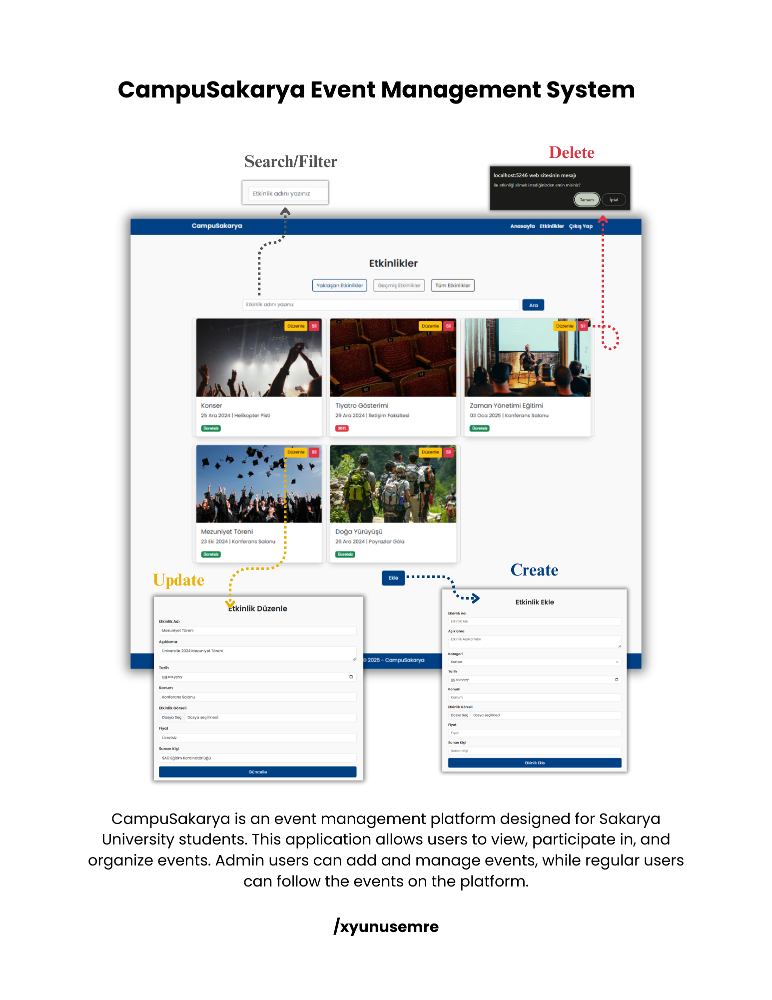

# CampuSakarya Event Management System

## Overview

CampuSakarya is an event management platform designed for Sakarya University students. This application allows users to view, participate in, and organize events. Admin users can add and manage events, while regular users can follow the events on the platform.

## Features

- **User Management**:
  - User registration and login functionality.
  - Authentication with admin and regular user roles.

- **Event Management**:
  - Admin users can add, edit, and delete events.
  - Events can be listed and viewed by users.

- **Security**:
  - Authentication and authorization for secure access.
  - User data is protected with password encryption.

## Technologies Used

- **Backend**: ASP.NET Core MVC
- **Database**: SQLite (with Entity Framework Core)
- **Authentication & Authorization**: ASP.NET Core Identity
- **Frontend**: Bootstrap for a modern and user-friendly design.

## How It Works

1. **User Registration and Login**:
   - Users can register and log in to the platform.
   - Admin users have special permissions for managing events.

2. **Event Management**:
   - Admin users can add, edit, and delete events.
   - Users can view all events and their details.

3. **Roles and Authorization**:
   - "Admin" role: Event management and user control.
   - "User" role: Event participation and viewing.

## Screenshots

*Login screen for users*

## File Structure

- **Controllers**: Controllers for the application logic.
- **Models**: Database models and data structures.
- **Views**: Razor files for the user interface.
- **ViewModels**: Models for passing data between views and controllers.
- **Data**:
  - `AppDbContext`: Database context for event management.
  - `AppIdentityDbContext`: Database context for authentication.
- **wwwroot**:
  - Static files (CSS, JavaScript, images).

## Contact

If you have any questions or suggestions, feel free to open an issue or contact me at: [yunusemrekahraman@aol.com](mailto:yunusemrekahraman@aol.com).
